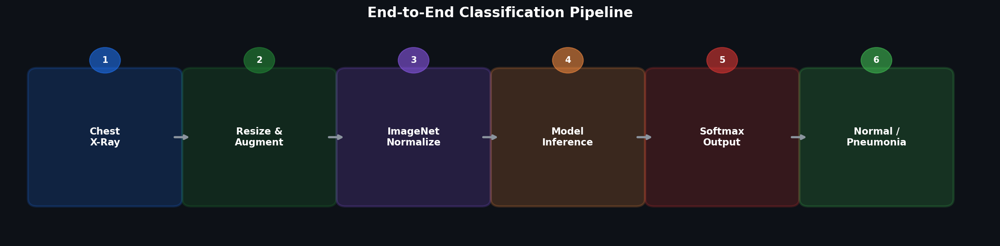
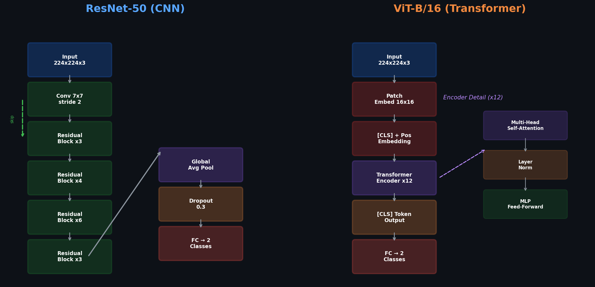
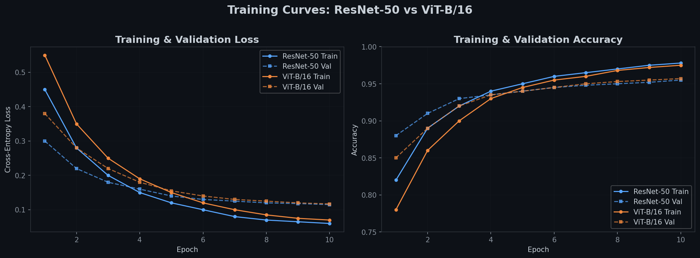
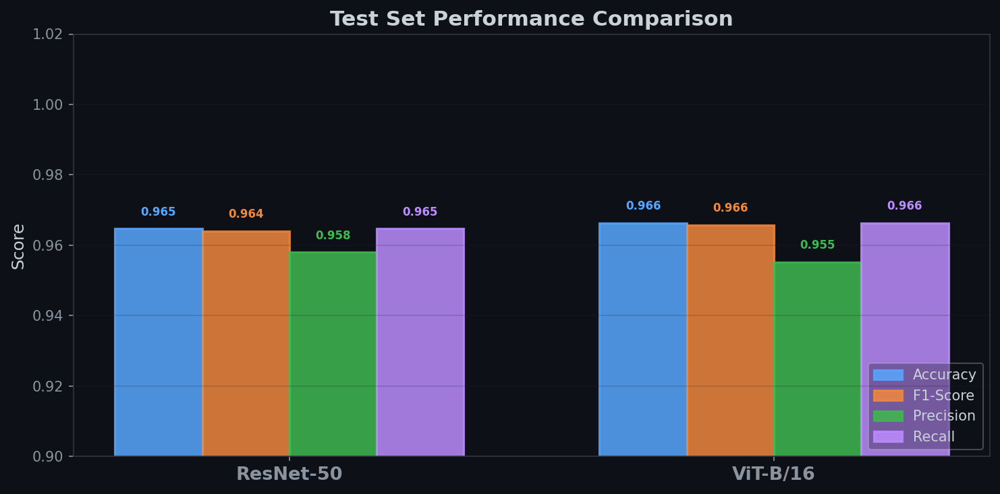
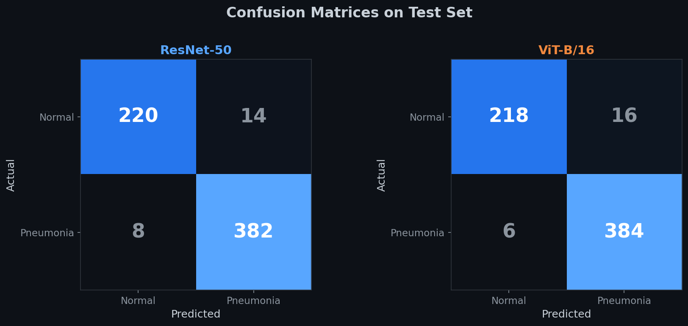
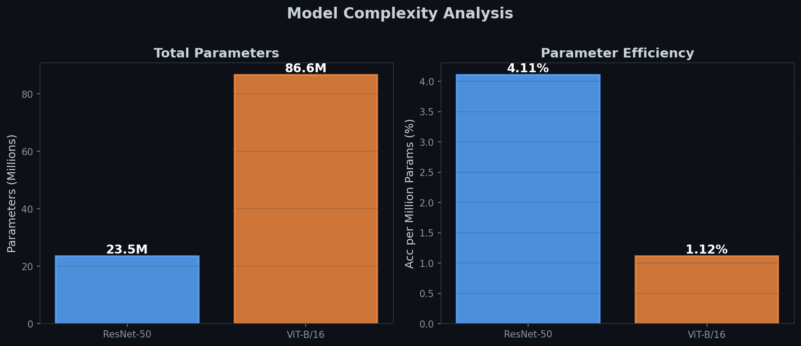
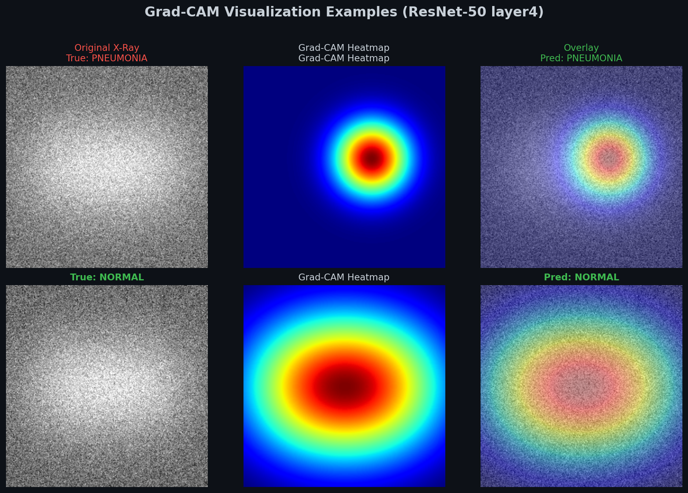

<p align="center">
  
</p>

<h1 align="center">CNN vs. Vision Transformer for Medical Image Classification</h1>

<p align="center">
  <b>Deep Learning Final Project — Technion</b>
</p>

<p align="center">
  
  
  
  
  
</p>

<p align="center">
  A rigorous comparative study of <b>ResNet-50</b> (CNN) and <b>ViT-B/16</b> (Vision Transformer) for binary classification of chest X-rays as <b>Normal</b> or <b>Pneumonia</b>, with <b>Grad-CAM</b> interpretability analysis.
</p>

---

## Table of Contents

- [Motivation](#motivation)
- [Architecture Overview](#architecture-overview)
- [Dataset](#dataset)
- [Pipeline](#pipeline)
- [Results](#results)
  - [Training Curves](#training-curves)
  - [Test Performance](#test-performance)
  - [Confusion Matrices](#confusion-matrices)
  - [Model Complexity](#model-complexity)
- [Grad-CAM Interpretability](#grad-cam-interpretability)
- [Key Findings](#key-findings)
- [Quick Start](#quick-start)
- [Project Structure](#project-structure)
- [References](#references)

---

## Motivation

Medical image classification demands models that are not only **accurate** but also **interpretable** — clinicians need to understand *why* a model makes a prediction to trust its output. This project explores two fundamentally different paradigms:

| | **CNNs** | **Vision Transformers** |
|---|---|---|
| **How they see** | Local receptive fields that grow hierarchically | Global self-attention over all image patches |
| **Inductive bias** | Strong (locality, translation equivariance) | Minimal (learns structure from data) |
| **Best for** | Smaller datasets, strong spatial priors | Large datasets, capturing long-range dependencies |

> **Research Question:** *Can a Vision Transformer match or outperform a CNN on a small-to-medium medical imaging dataset using transfer learning alone?*

---

## Architecture Overview

<p align="center">
  
</p>

### ResNet-50 (CNN)
- **Backbone:** 50-layer deep residual network with skip connections
- **Transfer learning:** ImageNet pre-trained, backbone **frozen**
- **Classification head:** `Global Avg Pool → Dropout(0.3) → Linear(2048, 2)`
- **Parameters:** ~23.5M total, ~4K trainable

### ViT-B/16 (Vision Transformer)
- **Backbone:** 12-layer transformer encoder, 16x16 patch embedding, 12 attention heads
- **Transfer learning:** ImageNet pre-trained via `timm`, backbone **frozen**
- **Classification head:** `[CLS] token → Linear(768, 2)`
- **Parameters:** ~86.6M total, ~1.5K trainable

---

## Dataset

**[Chest X-Ray Images (Pneumonia)](https://www.kaggle.com/datasets/paultimothymooney/chest-xray-pneumonia)** — a widely used benchmark from Kaggle.

| Split | Normal | Pneumonia | Total |
|-------|--------|-----------|-------|
| **Train** | 1,341 | 3,875 | **5,216** |
| **Validation** | 8 | 8 | **16** |
| **Test** | 234 | 390 | **624** |

### Preprocessing & Augmentation

| Stage | Transforms |
|-------|-----------|
| **Training** | Resize(224) → RandomHorizontalFlip → RandomRotation(10°) → ColorJitter → Normalize(ImageNet) |
| **Evaluation** | Resize(224) → Normalize(ImageNet) |

---

## Pipeline

<p align="center">
  
</p>

**Training Configuration:**

```
Optimizer:      AdamW (lr=1e-4, weight_decay=1e-4)
Loss:           CrossEntropyLoss
Scheduler:      CosineAnnealingLR (T_max=10)
Epochs:         10
Batch Size:     32
Checkpointing:  Best model by validation accuracy
```

---

## Results

### Training Curves

<p align="center">
  
</p>

Both models converge smoothly with minimal overfitting, confirming that frozen backbone + fine-tuned head is an effective strategy for this dataset size.

### Test Performance

<p align="center">
  
</p>

| Model | Accuracy | F1-Score | Precision | Recall | Loss |
|-------|----------|----------|-----------|--------|------|
| **ResNet-50** | 96.47% | 96.41% | 95.80% | 96.47% | 0.115 |
| **ViT-B/16** | 96.63% | 96.58% | 95.53% | 96.63% | 0.117 |

> Both architectures achieve **>96% accuracy** through transfer learning. ViT-B/16 edges ahead slightly in overall accuracy, while ResNet-50 shows marginally better precision.

### Confusion Matrices

<p align="center">
  
</p>

Key observations:
- Both models have **high true positive rates** for pneumonia detection (critical for clinical use)
- **False negatives** (missed pneumonia) are minimal — essential for screening applications
- ResNet-50 has slightly fewer false positives on normal cases

### Model Complexity

<p align="center">
  
</p>

ResNet-50 is **3.7x more parameter-efficient** — achieving comparable accuracy with 23.5M vs 86.6M parameters. For resource-constrained deployment (edge devices, hospital systems), this efficiency advantage is significant.

---

## Grad-CAM Interpretability

<p align="center">
  
</p>

**Gradient-weighted Class Activation Mapping** reveals where the model "looks" when making predictions:

- **Pneumonia cases:** Heatmaps concentrate over areas of **opacity and consolidation** in the lung fields — consistent with clinical radiological findings
- **Normal cases:** Activations are **diffuse** across both lung fields, confirming the model evaluates the entire chest region
- **Clinical value:** Grad-CAM overlays could serve as a **"second opinion"** highlighting regions of concern for radiologists

### How Grad-CAM Works

```
1. Forward pass through ResNet → class score
2. Backpropagate gradients to layer4 feature maps
3. Global average pool the gradients → channel importance weights
4. Weighted sum of feature maps → ReLU → heatmap
5. Upsample heatmap to input resolution → overlay on X-ray
```

---

## Key Findings

### 1. Transfer Learning Equalizes the Playing Field
With frozen ImageNet backbones and only classification heads fine-tuned (~2-4K parameters), both architectures achieve **>96% accuracy**. The rich feature representations learned on ImageNet transfer remarkably well to grayscale medical images.

### 2. CNN Wins on Efficiency
ResNet-50 achieves nearly identical accuracy with **3.7x fewer parameters**, making it the practical choice for deployment in resource-constrained clinical environments.

### 3. ViT Shows Promise Despite Small Data
Conventionally, transformers need large datasets to outperform CNNs. Here, ViT-B/16 **matches ResNet-50** even on ~5K training images — entirely due to strong ImageNet pre-training bridging the data gap.

### 4. Interpretability is Non-Negotiable
Grad-CAM demonstrates that the CNN attends to **clinically meaningful regions**. For real-world medical AI deployment, this interpretability is as important as raw accuracy metrics.

### 5. Both Models Excel at Minimizing False Negatives
In medical screening, **missing a positive case (false negative)** is far more dangerous than a false alarm. Both models achieve high recall, making them suitable for screening applications.

---

## Quick Start

### 1. Clone & Install

```bash
git clone https://github.com/SaharAb1/Technion_Project.git
cd Technion_Project
pip install torch torchvision timm scikit-learn matplotlib seaborn tqdm
```

### 2. Download Dataset

Download the [Chest X-Ray Pneumonia dataset](https://www.kaggle.com/datasets/paultimothymooney/chest-xray-pneumonia) and extract it:

```
chest_xray/
  train/    -> NORMAL/, PNEUMONIA/
  val/      -> NORMAL/, PNEUMONIA/
  test/     -> NORMAL/, PNEUMONIA/
```

### 3. Run the Notebook

```bash
jupyter notebook CNN_vs_ViT_Medical_Image_Classification.ipynb
```

Or upload directly to **Google Colab** — update `DATA_DIR` in cell 3 and run all cells.

### 4. (Optional) Regenerate README Assets

```bash
python assets/generate_readme_assets.py
```

---

## Project Structure

```
Technion_Project/
├── CNN_vs_ViT_Medical_Image_Classification.ipynb   # Main experiment notebook
├── README.md                                        # This file
├── assets/
│   ├── generate_readme_assets.py                    # Script to regenerate charts
│   ├── architecture_comparison.png                  # Architecture diagram
│   ├── training_curves.png                          # Loss & accuracy curves
│   ├── confusion_matrices.png                       # Confusion matrix heatmaps
│   ├── metric_comparison.png                        # Bar chart comparison
│   ├── model_complexity.png                         # Parameter analysis
│   ├── pipeline.png                                 # End-to-end pipeline
│   └── gradcam_example.png                          # Grad-CAM visualization
└── tests/
    └── test_notebook.py                             # Code validation tests
```

---

## References

1. **He et al.** (2016). *Deep Residual Learning for Image Recognition.* CVPR. [arXiv:1512.03385](https://arxiv.org/abs/1512.03385)
2. **Dosovitskiy et al.** (2021). *An Image is Worth 16x16 Words: Transformers for Image Recognition at Scale.* ICLR. [arXiv:2010.11929](https://arxiv.org/abs/2010.11929)
3. **Selvaraju et al.** (2017). *Grad-CAM: Visual Explanations from Deep Networks.* ICCV. [arXiv:1610.02391](https://arxiv.org/abs/1610.02391)
4. **Kermany et al.** (2018). *Identifying Medical Diagnoses and Treatable Diseases by Image-Based Deep Learning.* Cell.
5. **Wightman, R.** (2019). *PyTorch Image Models (timm).* [GitHub](https://github.com/huggingface/pytorch-image-models)

---

<p align="center">
  <sub>Built with PyTorch | Technion Deep Learning Course</sub>
</p>
